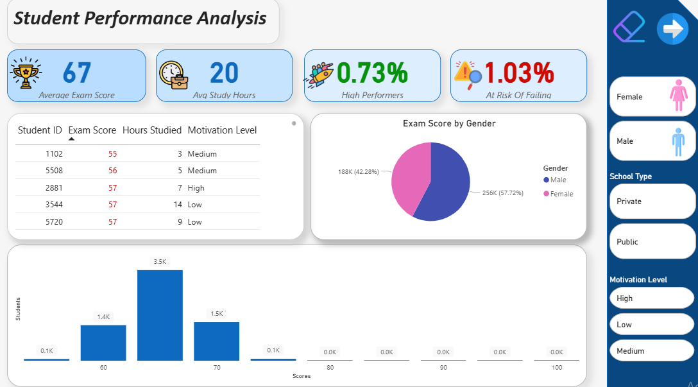
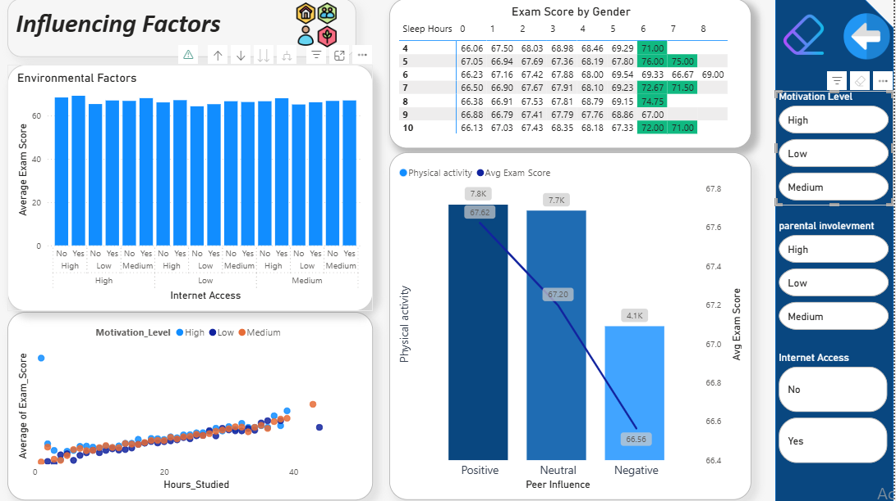

# 🎓 Student Performance Dashboard (Power BI)

> 📊 An interactive analytics dashboard built in Power BI to explore the key factors influencing student exam performance.

---

## 📘 Project Overview

This Power BI project analyzes a dataset of student performance factors to understand what influences exam scores. The goal is to provide educators, researchers, or analysts with a tool to identify performance trends, behavioral impacts, and areas for targeted academic support.

---

## 🔎 Dataset

The dashboard is based on the file:  
📁 `StudentPerformanceFactors.csv`  
It includes features such as:
- Exam scores
- Study hours
- Tutoring sessions
- Motivation level
- Parental involvement
- Sleep habits
- Peer influence
- Internet access and more

---

## 📊 Dashboard Structure

The report is divided into **three pages**, each targeting a different level of insight:

### 🔹 1. Main Page – Executive Summary
- 📈 KPI Cards: Avg Exam Score, % High Performers, % At Risk, Avg Study Hours
- 📊 Histogram: Exam Score distribution
- 📘 Breakdown by Gender and Motivation Level
- 📋 Dynamic table with conditional formatting and slicers
-

### 🔹 2. Influencing Factors (Behavioral + Support)
- 🧠 Scatter plot: Study Hours vs. Exam Score
- 📊 Column chart: Average scores by support categories (Parental Involvement, Resources, Tutoring)
- 🔥 Matrix heatmap: Sleep Hours vs. Tutoring Sessions
- 📉 Combo chart: Peer Influence and Physical Activity
- 🎛️ Slicers: Gender, School Type, Motivation, Internet Access, etc.
-

### 🔹 3. (Coming Soon) Segmentation & What-If Simulation
- Student clustering by behavior and support
- Predictive analysis based on study/tutoring input
- What-if scenario tool to estimate performance changes

---

## 📁 Files Included

| File | Description |
|------|-------------|
| `StudentPerformanceFactors.pbix` | Power BI report file (open in Power BI Desktop) |
| `StudentPerformanceFactors.csv` | Original dataset |
| `StudentDashboard.pdf` | Exported visual version of the report |
| `README.md` | Project documentation |

---

## 🧠 Key Insights

- Students with high motivation and access to tutoring consistently score above average.
- Sleep deprivation combined with intense study hours shows diminishing returns.
- Parental involvement and internet access strongly correlate with performance in lower-income students.
- Clear at-risk groups can be identified based on behavioral patterns and low support.

---

## 🚀 How to Use

1. **Download** the `.pbix` file and open it in Power BI Desktop.
2. Explore each page using slicers (gender, motivation, etc.).
3. Hover over charts for tooltips and detailed breakdowns.
4. Modify the dataset or add your own values to experiment further.

---

## 🛠️ Tools Used

- Microsoft Power BI (Desktop)
- DAX for calculated measures and logic
- Clean and modern UI with blue-gray visual theme

---

## 💡 Next Steps

- Add clustering & persona analysis (Page 3)
- Enable what-if sliders for simulation modeling
- Convert to public interactive version (if privacy allows)
- Integrate with a personal portfolio website

---

## 📬 Contact

Feel free to reach out if you have questions, want to collaborate, or want feedback on your own dashboard projects!

- GitHub: https://github.com/arsenishvili1nata
- LinkedIn: https://www.linkedin.com/in/nata-arsenishvili-59725a274/

---

**📌 Note:** This report uses fictional or anonymized data for educational purposes.

